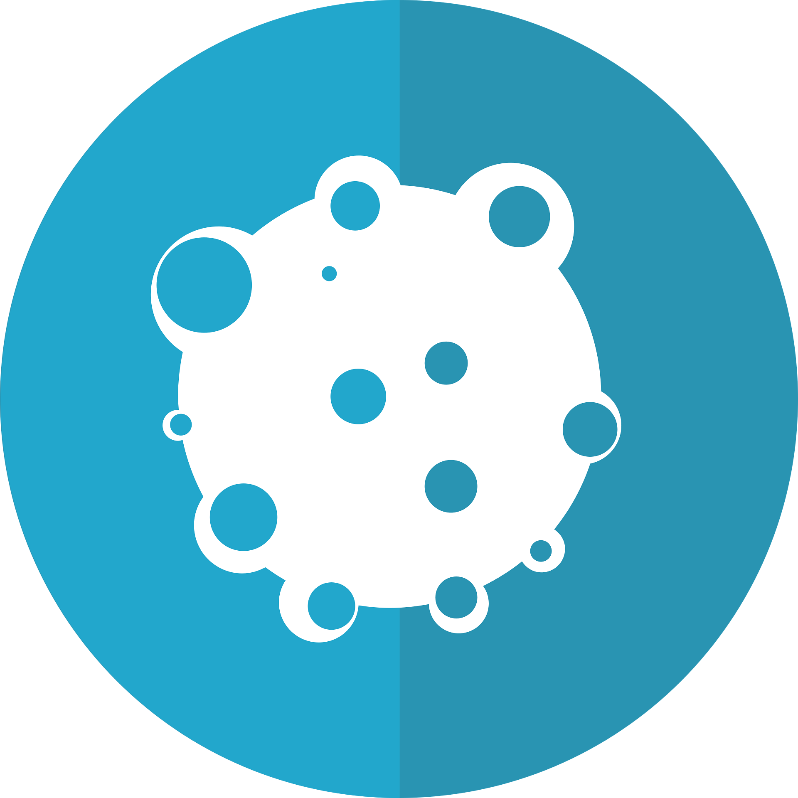

  <picture>
    
  </picture>

# Quantum Simulation in Medical Sciences for Early Cancer Detection

## Overview

Bioinformatics course project that includes:

1. Research objective.
2. Experimental framework – datasets, choice of analysis method and technique, libraries and software tools used, technologies.
3. Data processing and analysis.
4. Presentation and visualization of results.
5. Conclusion. Appendices (code, screenshots with results, link to datasets).

Our team will present the developments in the form of a presentation, with each team member presenting their part of the team work. 
We will attach documentation and a presentation.

